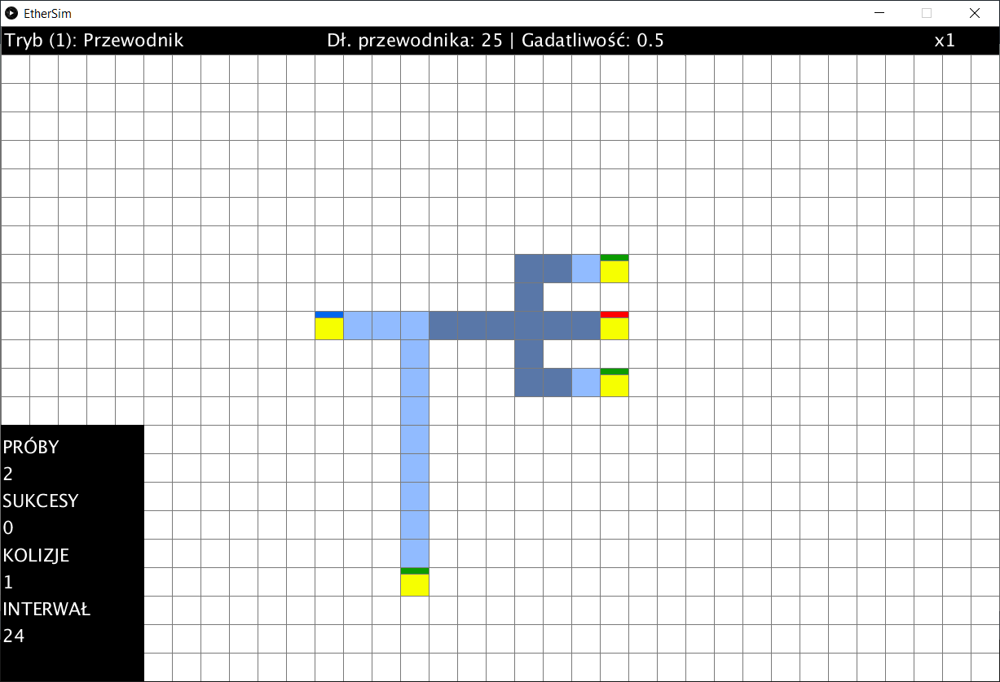

# EtherSim

Sandboksowy edytor topologii sieci komputerowej, w którym mo¿na symulowaæ przep³yw informacji pomiêdzy urz¹dzeniami koñcowymi. Wa¿nym aspektem symulacji jest wykrywanie i rozwi¹zywanie kolizji na ³¹czu.

